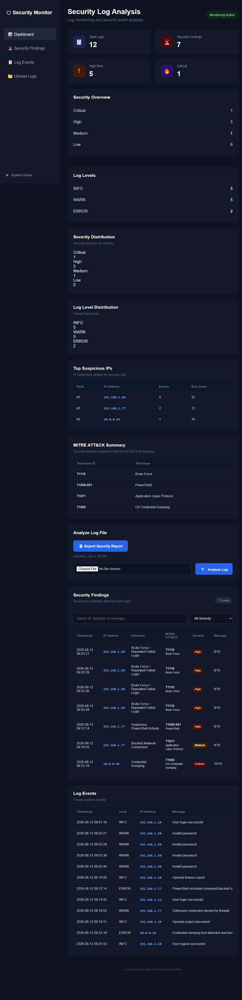

# 🛡️ Log Analysis Dashboard

> A lightweight SOC-style cybersecurity dashboard for security log analysis, threat detection, MITRE ATT&CK mapping, IP risk scoring, and automated PDF security reporting.



## 🎯 Project Highlights

- 🔍 Automated security log analysis
- 🚨 Brute-force and suspicious activity detection
- ⚡ Suspicious PowerShell detection
- 🔑 Credential dumping detection
- 🌐 IP-based risk scoring
- 🎯 MITRE ATT&CK technique mapping
- 📊 Security statistics and severity analysis
- 📑 Automated PDF security reports
- 🖥️ Flask-based SOC-style dashboard

### 🔄 Security Analysis Workflow

```text
Log File
   ↓
Log Parser
   ↓
Security Analyzer
   ↓
Detection Rules
   ↓
Severity & Risk Scoring
   ↓
MITRE ATT&CK Mapping
   ↓
Flask Dashboard
   ↓
PDF Security Report


🚀 Key Features
📄 Security log parsing
📤 Log file upload
🔍 Automated security event detection
🚨 Failed login detection
🔐 Brute-force / repeated failed login detection
⚡ Suspicious PowerShell activity detection
🌐 Blocked network connection detection
🔑 Credential dumping detection
🎯 Security severity classification
🌍 IP-based risk scoring
📊 Security statistics
📈 Log-level distribution
🎯 MITRE ATT&CK technique mapping
🖥️ Flask-based security dashboard
📑 PDF security report generation
🧪 Sample security log for testing


🔎 Security Detection Rules

The analyzer currently identifies the following security events:

| Detection                           | Severity | Score | MITRE ATT&CK |
| ----------------------------------- | -------: | ----: | ------------ |
| Repeated Failed Login / Brute Force |     High |     8 | T1110        |
| Suspicious PowerShell Activity      |     High |     8 | T1059.001    |
| Blocked Network Connection          |   Medium |     4 | T1071        |
| Credential Dumping                  | Critical |    10 | T1003        |
| Critical Log Event                  | Critical |    10 | T1204        |
| Unauthorized Access                 |     High |     8 | T1078        |
| Suspicious Activity                 |   Medium |     5 | T1059        |
| Generic System Error                |      Low |     2 | T1562        |


Severity Levels

| Severity    | Meaning                              |
| ----------- | ------------------------------------ |
| 🔴 Critical | Immediate investigation required     |
| 🟠 High     | Serious suspicious activity          |
| 🟡 Medium   | Suspicious activity requiring review |
| 🟢 Low      | Lower-risk security event            |


🎯 MITRE ATT&CK Mapping

Detected activities are mapped to relevant MITRE ATT&CK techniques.

Current sample analysis includes:

| Technique ID | Technique                  | Events |
| ------------ | -------------------------- | -----: |
| T1110        | Brute Force                |      4 |
| T1059.001    | PowerShell                 |      1 |
| T1071        | Application Layer Protocol |      1 |
| T1003        | OS Credential Dumping      |      1 |


📊 Sample Analysis

The included data/sample.log contains 12 security events.

Current Sample Results

| Metric            | Value |
| ----------------- | ----: |
| Total Logs        |    12 |
| Security Findings |     7 |
| Critical          |     1 |
| High              |     5 |
| Medium            |     1 |
| Low               |     0 |

🌐 IP Risk Analysis

| IP Address   | Risk Level | Score | Events |
| ------------ | ---------- | ----: | -----: |
| 192.168.1.50 | Critical   |    32 |      4 |
| 192.168.1.77 | High       |    12 |      2 |
| 10.0.0.44    | Medium     |    10 |      1 |

Risk Calculation

The dashboard aggregates security finding scores for each suspicious IP.

Score >= 20  → Critical
Score >= 12  → High
Score >= 5   → Medium
Score < 5    → Low

🏗️ Project Architecture

                    ┌────────────────────┐
                    │   Security Log     │
                    │    (.log / .txt)   │
                    └─────────┬──────────┘
                              │
                              ▼
                    ┌────────────────────┐
                    │    Log Parser      │
                    │  log_parser.py     │
                    └─────────┬──────────┘
                              │
                              ▼
                    ┌────────────────────┐
                    │ Security Analyzer  │
                    │   analyzer.py      │
                    └─────────┬──────────┘
                              │
              ┌───────────────┴────────────────┐
              ▼                                ▼
     ┌─────────────────┐              ┌─────────────────┐
     │ Detection Rules │              │  Risk Scoring   │
     │ Severity        │              │  IP Analysis    │
     └────────┬────────┘              └────────┬────────┘
              │                                │
              └──────────────┬─────────────────┘
                             ▼
                  ┌─────────────────────┐
                  │ MITRE ATT&CK        │
                  │ Technique Mapping   │
                  └──────────┬──────────┘
                             │
                             ▼
                  ┌─────────────────────┐
                  │   Flask Dashboard   │
                  │       app.py        │
                  └──────────┬──────────┘
                             │
                   ┌─────────┴─────────┐
                   ▼                   ▼
            ┌────────────┐      ┌────────────┐
            │ Web UI     │      │ PDF Report │
            │ Dashboard  │      │ report.py  │
            └────────────┘      └────────────┘

🛠️ Technologies Used

Python
Flask
Regular Expressions
HTML5
CSS3
FPDF / PDF Generation
Git
GitHub
MITRE ATT&CK

📁 Project Structure

Log-Analysis-Dashboard/
│
├── app.py
├── analyzer.py
├── log_parser.py
├── report.py
├── requirements.txt
├── README.md
├── .gitignore
│
├── data/
│   └── sample.log
│
├── templates/
│   └── dashboard.html
│
├── static/
│   └── style.css
│
├── screenshots/
│   └── dashboard-final.png
│
└── reports/
    └── Security_Log_Report.pdf

⚙️ Installation
1. Clone the Repository

git clone https://github.com/adityasoc/Log-Analysis-Dashboard.git
cd Log-Analysis-Dashboard

2. Create Virtual Environment

python -m venv venv

3. Activate Virtual Environment
Windows PowerShell

.\venv\Scripts\Activate.ps1

Windows CMD

venv\Scripts\activate

4. Install Dependencies

pip install -r requirements.txt


## ▶️ Running the Application

Start the Flask dashboard:

```bash
python app.py

Then open the application in your browser:

http://127.0.0.1:5000

🧪 Testing the Dashboard

A sample security log is included:

data/sample.log

You can upload the sample log through the dashboard to test:

Log parsing
Security event detection
Severity classification
Risk scoring
MITRE ATT&CK mapping
IP risk analysis
PDF report generation

📑 Security Report

The application can generate a PDF security report containing analyzed security findings and risk information.

Generated reports are stored in:

reports/

🖥️ Dashboard Screenshot

🔐 Cybersecurity Concepts Demonstrated

This project demonstrates practical understanding of:

Security log analysis
SOC monitoring workflow
Detection engineering
Incident triage concepts
Authentication attack detection
Brute-force detection
PowerShell activity monitoring
Network security event analysis
IP risk scoring
MITRE ATT&CK mapping
Security reporting
Flask web application development

🎓 Project Purpose

This project was developed as a practical cybersecurity project to demonstrate how security logs can be processed and converted into actionable security findings.

It is intended for educational, portfolio, and cybersecurity learning purposes.

👨‍💻 Author

Aditya Kumar

Cybersecurity / SOC Analyst Enthusiast

GitHub:
https://github.com/adityasoc

⭐ Future Improvements

Potential future enhancements include:

Real-time log monitoring
Windows Event Log integration
Splunk/SIEM integration
More advanced detection rules
Authentication anomaly detection
Threat intelligence integration
Automated alerting
Database-backed log storage
Role-based dashboard access
