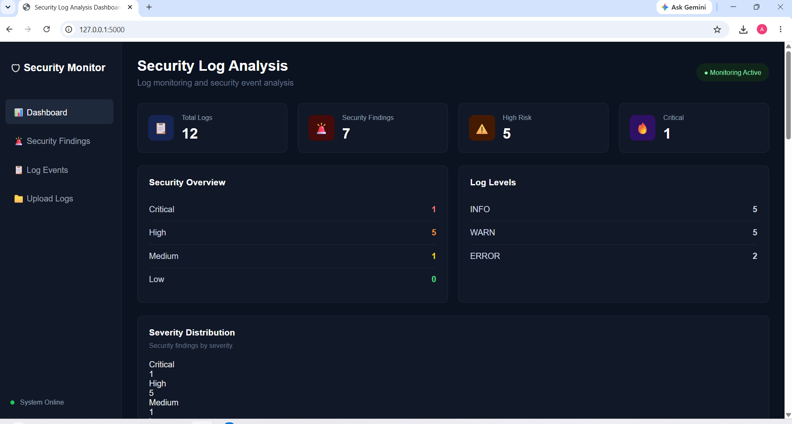

# 🛡️ Log Analysis Dashboard

A Python and Flask-based defensive cybersecurity dashboard for analyzing security logs, detecting suspicious activities, calculating IP risk, and generating PDF security reports.

---

## 📌 Project Overview

Log Analysis Dashboard is a lightweight Security Operations Center (SOC)-style log analysis application.

It parses structured security logs, identifies suspicious events, assigns severity levels, calculates IP-based risk scores, and presents the results through a web dashboard.

The project demonstrates a basic defensive security workflow:

Log File → Log Parser → Security Analyzer → Risk Scoring → Dashboard → PDF Report

---

## 🚀 Key Features

- 📄 Security log parsing
- 📤 Log file upload
- 🔍 Automated security event detection
- 🚨 Failed login detection
- 🔐 Brute-force / repeated failed login detection
- ⚡ Suspicious PowerShell activity detection
- 🌐 Blocked network connection detection
- 🔑 Credential dumping detection
- 🎯 Security severity classification
- 🌍 IP risk scoring
- 📊 Security statistics and log-level distribution
- 🖥️ Flask web dashboard
- 📑 PDF security report generation
- 🧪 Sample security log for testing

---

## 🔎 Security Detection

The analyzer currently identifies several security-related patterns.

| Detection | Severity | Score |
|-----------|----------|-------|
| Repeated Failed Login / Brute Force | High | 8 |
| Suspicious PowerShell Activity | High | 8 |
| Blocked Network Connection | Medium | 4 |
| Credential Dumping | Critical | 10 |
| Critical Log Event | Critical | 10 |
| Unauthorized Access | High | 8 |
| Suspicious Activity | Medium | 5 |

Severity levels:

| Severity | Meaning |
|----------|---------|
| 🔴 Critical | Immediate investigation required |
| 🟠 High | Serious security activity |
| 🟡 Medium | Suspicious activity requiring review |
| 🟢 Low | Lower-risk activity |

---

## 📊 Sample Analysis

The included `data/sample.log` contains 12 security events.

Current sample analysis produces:

```text
Total Logs        : 12
Security Findings : 7
Critical          : 1
High              : 5
Medium            : 1
Low               : 0

Example suspicious IP risk analysis:
192.168.1.50 | Risk: Critical | Score: 32 | Events: 4
192.168.1.77 | Risk: High     | Score: 12 | Events: 2
10.0.0.44    | Risk: Medium   | Score: 10 | Events: 1

🏗️ Project Architecture
                    ┌─────────────────┐
                    │   Security Log  │
                    │   (.log / .txt) │
                    └────────┬────────┘
                             │
                             ▼
                    ┌─────────────────┐
                    │   Log Parser    │
                    │  log_parser.py  │
                    └────────┬────────┘
                             │
                             ▼
                    ┌─────────────────┐
                    │ Security        │
                    │ Analyzer        │
                    │ analyzer.py     │
                    └────────┬────────┘
                             │
                ┌────────────┴────────────┐
                ▼                         ▼
        ┌───────────────┐         ┌───────────────┐
        │ Risk Scoring  │         │ Statistics    │
        │ IP Analysis   │         │ & Findings    │
        └───────┬───────┘         └───────┬───────┘
                │                         │
                └────────────┬────────────┘
                             ▼
                    ┌─────────────────┐
                    │ Flask Dashboard │
                    │     app.py      │
                    └────────┬────────┘
                             │
                    ┌────────┴────────┐
                    ▼                 ▼
             ┌────────────┐    ┌────────────┐
             │ Web UI     │    │ PDF Report │
             │ Dashboard  │    │ report.py  │
             └────────────┘    └────────────┘
🛠️ Technologies Used
Python
Flask
Regular Expressions
HTML
CSS
FPDF / PDF generation
Git & GitHub

📁 Project Structure
Log-Analysis-Dashboard/
│
├── app.py                  # Flask application
├── analyzer.py             # Security detection and risk analysis
├── log_parser.py           # Log parsing logic
├── report.py               # PDF report generation
├── requirements.txt        # Python dependencies
├── README.md               # Project documentation
├── .gitignore              # Git exclusions
│
├── data/
│   └── sample.log          # Sample security log
│
├── templates/
│   └── dashboard.html      # Dashboard interface
│
├── static/
│   └── style.css           # Dashboard styling
│
└── reports/
    └── Security_Log_Report.pdf  # Generated locally

⚙️ Installation
1. Clone the repository
git clone https://github.com/adityasoc/Log-Analysis-Dashboard.git
cd Log-Analysis-Dashboard

2. Create a virtual environment

Windows PowerShell:

python -m venv venv

Activate it:

.\venv\Scripts\Activate.ps1

If PowerShell blocks script execution, run:

Set-ExecutionPolicy -Scope Process -ExecutionPolicy Bypass

Then:

.\venv\Scripts\Activate.ps1
3. Install dependencies
pip install -r requirements.txt
▶️ Running the Application

Start the Flask application:

python app.py

Open the dashboard:

http://127.0.0.1:5000
🧪 Testing the Analyzer

Run the log parser:

python -c "from log_parser import parse_log_file; logs=parse_log_file('data/sample.log'); print('LOG COUNT:', len(logs)); print(logs)"

Run the complete security analysis:

python -c "from log_parser import parse_log_file; from analyzer import analyze_logs, get_statistics; logs=parse_log_file('data/sample.log'); findings=analyze_logs(logs); stats=get_statistics(logs, findings); print('LOGS:', len(logs)); print('FINDINGS:', len(findings)); print('STATS:', stats)"
📑 PDF Security Report

The dashboard provides an Export Security Report option.

The generated report is saved locally as:

reports/Security_Log_Report.pdf

Generated PDF reports are excluded from Git using .gitignore.

🔐 Example Log Format
2026-08-12 09:03:21 | WARN | src_ip=192.168.1.50 | user=admin | event=LOGIN | status=FAILED | message=Invalid password

The parser extracts:

Timestamp
Log level
Source IP
User
Event
Status
Message
🎯 Project Purpose

This project was developed as a practical cybersecurity project to demonstrate:

Security log analysis
Basic SOC monitoring concepts
Detection engineering
IP risk assessment
Security event classification
Python automation
Flask web application development
Security reporting
⚠️ Disclaimer

This project is intended for educational and defensive cybersecurity purposes only.

The detection rules are simplified and should not be considered a replacement for production SIEM platforms or enterprise-grade security monitoring systems.

🔮 Future Improvements
Real-time log monitoring
Windows Event Log integration
Linux authentication log integration
GeoIP-based IP analysis
MITRE ATT&CK technique mapping
Email security alerts
Splunk / SIEM integration
Database-backed event storage
User authentication
Advanced anomaly detection using machine learning
Docker deployment
👨‍💻 Author

Aditya Kumar

Cybersecurity / SOC Analyst Project

GitHub:
https://github.com/adityasoc

📜 License

This project is provided for educational and portfolio purposes.

---

## 🖥️ Dashboard Preview

The dashboard provides a visual overview of parsed logs, security findings, severity distribution, and suspicious IP risk.



